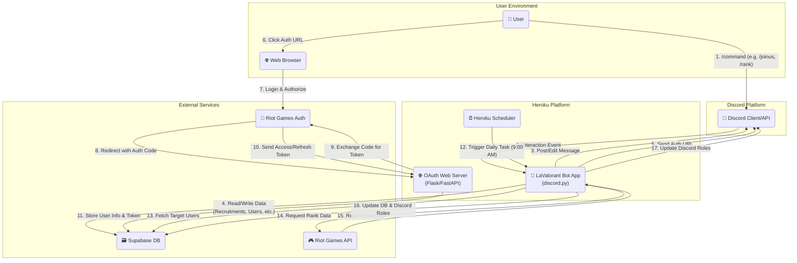
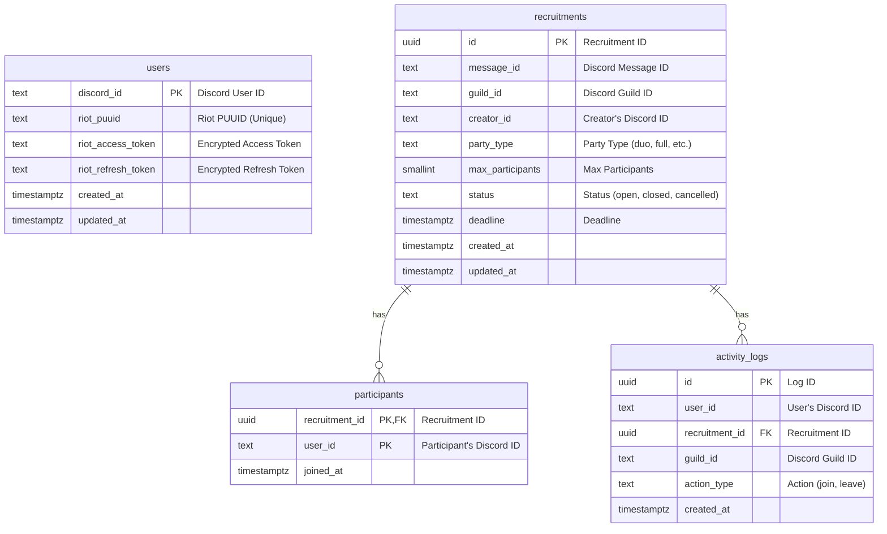
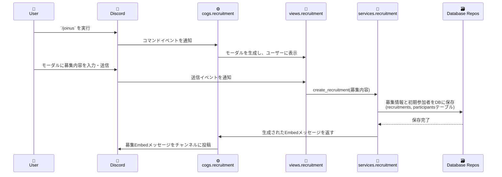
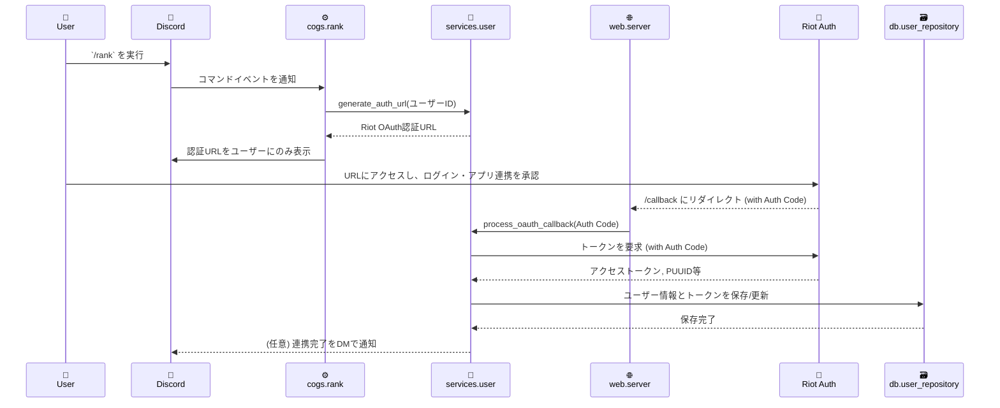
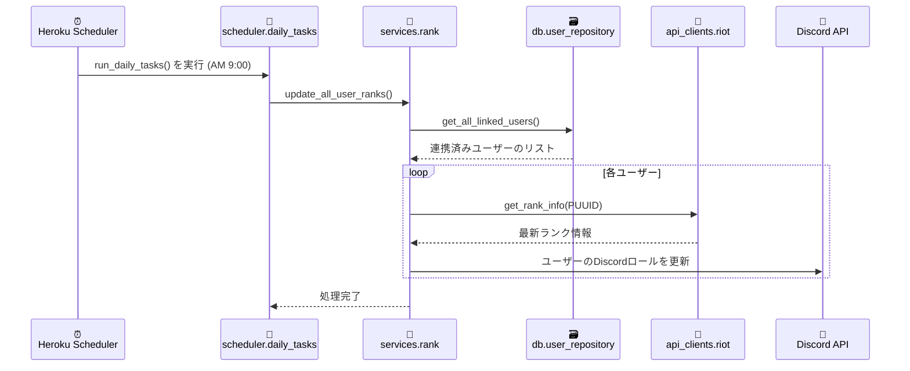

# LaValorant_dev 設計書

## 目次

### 第1部: 外部設計
1.  **システム概要**
    1.1. 目的
    1.2. 前提技術スタック
2.  **システム構成**
    2.1. 構成図
    2.2. コンポーネント説明
3.  **機能一覧**
    3.1. ユーザーコマンド機能
    3.2. インタラクション機能 (UI応答)
    3.3. 定期実行機能 (バッチ処理)
4.  **データベース設計 (物理設計)**
    4.1. ER図 (Entity-Relationship Diagram)
    4.2. テーブル定義

### 第2部: 内部設計
5.  **モジュール構成**
    5.1. ディレクトリ構造 (案)
    5.2. 各モジュールの責務
6.  **シーケンス図**
    6.1. `/joinus` (募集開始フロー)
    6.2. `/rank` (Riotアカウント連携フロー)
    6.3. 定期実行 (ランク更新フロー)
7.  **エラーハンドリング・セキュリティ設計**
    7.1. エラーハンドリング設計
    7.2. セキュリティ設計
8.  **テスト計画**
    8.1. 単体テスト (Unit Test)
    8.2. 結合テスト (Integration Test)
    8.3. E2E (End-to-End) テスト

---

## 第1部: 外部設計

### 1. システム概要

#### 1.1. 目的
本システムは、ゲーム「VALORANT」のプレイヤーが、Discordサーバー上で円滑に参加者を募集し、サーバー内での活動状況に基づいたコミュニティの活性化を促進することを目的とします。
また、Riot Games APIと連携し、ユーザーのランク情報を可視化することで、より質の高いマッチング体験の提供を目指します。

#### 1.2. 前提技術スタック
仕様書に基づき、以下の技術スタックを前提として設計を行います。

| カテゴリ | 技術・サービス |
| :--- | :--- |
| プログラミング言語 | Python |
| フレームワーク | discord.py |
| データベース | Supabase (PostgreSQL) |
| ホスティング環境 | Heroku |
| 定期実行エンジン | Heroku Scheduler |
| 外部連携API | Discord API, Riot Games API |

---

### 2. システム構成

#### 2.1. 構成図
システム全体のコンポーネントと、主要なデータの流れを以下に示します。



#### 2.2. コンポーネント説明

| コンポーネント | 役割 |
| :--- | :--- |
| **LaValorant Bot App** | 本システムのコアアプリケーション。Discordからのイベント(コマンド実行等)を処理し、募集管理、DB操作、Riot API連携などの主要なビジネスロジックを実行します。 |
| **OAuth Web Server** | Riot Games APIのOAuth認証フローにおいて、認証後のコールバックを受け取るための軽量なWebサーバー。Botアプリケーションと同じHeroku Dyno上で稼働させることを想定します。 |
| **Heroku Scheduler** | Herokuのアドオン。毎日定刻(AM 9:00)にバッチ処理を起動するためのトリガーとして機能します。 |
| **Discord** | ユーザーとの主要な接点(UI)となるプラットフォーム。スラッシュコマンドの受付、Embedメッセージやモーダルの表示、ロールの管理などを行います。 |
| **Supabase** | ユーザー情報、募集情報、活動ログなど、システムの永続データをすべて格納するデータベース(BaaS)です。 |
| **Riot Games (API/Auth)** | VALORANTのランク情報取得(API)と、ユーザーアカウントの認証(Auth)機能を提供します。 |
---

### 3. 機能一覧
仕様書に基づき、Botが提供する機能を整理しました。

#### 3.1. ユーザーコマンド機能
| コマンド | 機能概要 |
| :--- | :--- |
| **`/joinus`** | 参加者募集を開始します。オプションで確定メンバーを指定でき、実行者のVC参加者を自動でリストアップ後、モーダルで詳細条件（人数形態、残り人数、締切）を入力します。 |
| **`/cancel`** | 自身が開始した未完了の募集をキャンセルします。対象メッセージを更新し、参加者へDMで通知します。 |
| **`/edit`** | 自身が開始した募集中（締切前）の募集内容を編集します。 |
| **`/rank`** | Riotアカウントとの連携を開始します。ユーザー専用のRiot OAuth認証URLを発行し、DMで送信します。 |
| **`/help`** | Botの全コマンドの構文と使い方を記載したヘルプメッセージを表示します。 |

#### 3.2. インタラクション機能 (UI応答)
| 機能 | トリガー | 概要 |
| :--- | :--- | :--- |
| **募集への参加** | 募集Embedの`参加する`ボタン | 実行者を参加者リストに追加し、DBを更新後、募集Embedをリアルタイムに更新します。 |
| **参加の取消** | 募集Embedの`参加を取り消す`ボタン | 実行者を参加者リストから削除し、DBを更新後、募集Embedをリアルタイムに更新します。 |
| **募集情報の入力**| `/joinus`, `/edit`コマンド実行 | 人数形態、残り人数、締切時間を入力するためのモーダルを表示し、入力値を検証します。 |

#### 3.3. 定期実行機能 (バッチ処理)
| 機能 | 実行タイミング | 概要 |
| :--- | :--- | :--- |
| **ランク情報自動更新** | 毎日 AM 9:00 | 全連携ユーザーのVALORANTランクを取得し、Discordロールを自動で更新します。 |
| **活動評価ロール付与** | 毎日 AM 9:00 | 直近30日間の活動履歴を集計し、「レギュラーメンバー」および「幽霊部員」ロールを付与・更新します。 |

---

### 4. データベース設計 (物理設計)
仕様書の論理設計を基に、Supabase (PostgreSQL) での実装を想定した物理設計を以下に示します。
将来的な複数サーバーへの導入（拡張性）を考慮し、仕様書にはありませんでしたが`recruitments`と`activity_logs`テーブルに`guild_id`（DiscordサーバーのID）を追加することを提案します。

#### 4.1. ER図 (Entity-Relationship Diagram)



#### 4.2. テーブル定義
| テーブル名 | カラム名 | データ型 | 制約・備考 |
| :--- | :--- | :--- | :--- |
| **`users`** | `discord_id` | `text` | **PK** |
| | `riot_puuid` | `text` | `UNIQUE` |
| | `riot_access_token` | `text` | ※アプリケーション側で要暗号化 |
| | `riot_refresh_token` | `text` | ※アプリケーション側で要暗号化 |
| | `created_at` | `timestamptz`| `default now()` |
| | `updated_at` | `timestamptz`| `default now()` |
| **`recruitments`** | `id` | `uuid` | **PK**, `default gen_random_uuid()` |
| | `message_id` | `text` | `NOT NULL` |
| | `guild_id` | `text` | `NOT NULL`, **※追加提案** |
| | `creator_id` | `text` | `NOT NULL`, `INDEX` |
| | `party_type` | `text` | `NOT NULL` |
| | `max_participants` | `smallint` | `NOT NULL`, `CHECK (> 0)` |
| | `status` | `text` | `NOT NULL`, `DEFAULT 'open'`, `INDEX` |
| | `deadline` | `timestamptz`| `NOT NULL` |
| | `created_at` | `timestamptz`| `default now()` |
| | `updated_at` | `timestamptz`| `default now()` |
| **`participants`** | `recruitment_id` | `uuid` | **PK**, **FK** -> `recruitments.id` |
| | `user_id` | `text` | **PK** |
| | `joined_at` | `timestamptz`| `default now()` |
| **`activity_logs`** | `id` | `uuid` | **PK**, `default gen_random_uuid()` |
| | `user_id` | `text` | `NOT NULL` |
| | `recruitment_id` | `uuid` | `NOT NULL`, **FK** -> `recruitments.id` |
| | `guild_id` | `text` | `NOT NULL`, **※追加提案** |
| | `action_type` | `text` | `NOT NULL` |
| | `created_at` | `timestamptz`| `default now()`, `INDEX` |
---

## 第2部: 内部設計

### 5. モジュール構成
システムの保守性と拡張性を高めるため、単一責任の原則（SRP）に基づき、機能ごとにモジュールを分割します。以下にディレクトリ構造と各モジュールの責務を示します。

#### 5.1. ディレクトリ構造 (案)
```
LaValorant/
├── main.py                   # Bot起動、イベントリスナー登録 (エントリーポイント)
├── config.py                 # 環境変数読み込み・管理
|
├── cogs/                     # スラッシュコマンド群 (discord.pyのCog機能を利用)
│   ├── recruitment_cog.py    # /joinus, /cancel, /edit を担当
│   ├── rank_cog.py           # /rank を担当
│   └── utility_cog.py        # /help を担当
│
├── services/                 # ビジネスロジック層
│   ├── recruitment_service.py # 募集の作成・管理ロジック
│   ├── user_service.py       # ユーザー登録、OAuth処理ロジック
│   ├── rank_service.py       # ランク取得、ロール付与ロジック
│   └── activity_service.py   # 活動評価ロジック
│
├── db/                       # データベースアクセス層 (Repositoryパターン)
│   ├── database.py           # Supabaseクライアントの初期化・管理
│   ├── user_repository.py
│   ├── recruitment_repository.py
│   ├── participant_repository.py
│   └── activity_log_repository.py
│
├── api_clients/              # 外部APIクライアント層
│   └── riot_api_client.py    # Riot API連携 (レートリミット対応含む)
│
├── views/                    # Discord UIコンポーネント定義
│   ├── recruitment_view.py   # 募集Embedに表示するボタン(参加/取消)
│   └── recruitment_modal.py  # /joinus, /editで表示する入力モーダル
│
├── scheduler/                # 定期実行タスクスクリプト
│   └── daily_tasks.py        # ランク更新、活動評価を実行
│
└── web/                      # OAuthコールバック用Webサーバー
    └── server.py             # Flask/FastAPI等による軽量Webサーバー
```

#### 5.2. 各モジュールの責務
- **`cogs/`**: Discordからのコマンドやボタン操作を受け付ける窓口。ユーザー入力を検証し、適切な`services`を呼び出します。
- **`services/`**: システムの中核となるビジネスロジックを実装します。複数の`repositories`や`api_clients`を組み合わせて、一連の機能を完結させます。
- **`db/`**: データベースとの全てのやり取りをこの層にカプセル化（Repositoryパターン）。Service層はSQLを意識することなく、定義されたメソッドを通じてデータにアクセスします。
- **`api_clients/`**: Riot Games APIなど、外部APIとの通信を抽象化します。
- **`views/`**: 募集メッセージに表示されるボタンや、入力用のモーダルといったDiscordのUIコンポーネントを定義します。
- **`scheduler/`**: Heroku Schedulerから呼び出され、定期実行タスク（バッチ処理）を開始します。
- **`web/`**: Riot APIのOAuth認証フローにおける、コールバックを受け取るWebサーバーとしての役割を担います。

---

### 6. シーケンス図
主要なユースケースにおける、モジュール間の処理の流れを以下に示します。

#### 6.1. `/joinus` (募集開始フロー)


#### 6.2. `/rank` (Riotアカウント連携フロー)


#### 6.3. 定期実行 (ランク更新フロー)

---

### 7. エラーハンドリング・セキュリティ設計

#### 7.1. エラーハンドリング設計
予期せぬ事態が発生した際に、システムを安定させ、ユーザーと開発者の双方に適切な情報を提供するための設計です。

| エラー種別 | 発生例 | 対応方針 | 担当モジュール |
| :--- | :--- | :--- | :--- |
| **コマンド入力エラー** | `/joinus`の`募集締め切り時間`に不正な形式 (`あさって`等) を入力 | コマンド実行者にのみ見えるメッセージで、正しいフォーマットを案内し、処理を中断します。 | `cogs` |
| **権限・条件エラー** | 募集主ではないユーザーが`/cancel`を実行 | 「この操作を実行する権限がありません」等のメッセージを実行者にのみ表示し、処理を中断します。 | `services`, `cogs` |
| **外部APIエラー** | Riot APIがメンテナンス中、またはレートリミット超過 | **リトライ処理:** APIクライアント側で指数関数的バックオフ（Exponential Backoff）を用いて最大3回リトライします。<br>**最終失敗時:** ユーザーには「時間をおいて再度お試しください」と通知し、開発者向けに詳細なエラーログを記録します。 | `api_clients`, `services` |
| **データベースエラー**| データベースへの接続がタイムアウト | **運用中のエラー:** 処理を中断し、ユーザーには汎用的なエラーメッセージを表示後、`FATAL`レベルのログを記録します。<br>**起動時エラー:** Botの起動を中止し、ログに致命的エラーを記録してプロセスを終了させます。 | `db`, `services` |

#### 7.2. セキュリティ設計
悪意のある攻撃からシステムとユーザー情報を保護するための設計です。

| 要件 | 具体的な対策 | 担当モジュール/レイヤー |
| :--- | :--- | :--- |
| **SQLインジェクション対策** | `db`層（Repository）でのDB操作は、Supabaseクライアントライブラリが提供するパラメータ化クエリを徹底します。直接SQL文字列を組み立てることは禁止します。 | `db` |
| **機密情報の管理** | Discord Token, Riot API Key, DB接続情報、トークン暗号化キーは、すべてHerokuのConfig Vars（環境変数）で管理し、コードには一切含めません。 | 運用, `config.py` |
| **Riot APIトークンの保護** | DBの`users`テーブルに保存する`riot_access_token`および`riot_refresh_token`は、`cryptography`ライブラリ等を用いてアプリケーションレベルで暗号化します。 | `db/user_repository.py` |
| **不正なコマンド連打対策** | Discord.pyの`cooldown`機能を利用し、ユーザー単位でコマンド実行頻度に制限を設けます。（例: `/joinus`は10秒に1回まで） | `cogs` |
| **入力値の無害化** | ユーザーからの入力をDiscordメッセージ等で表示する際は、Discord.pyの標準機能によって意図しないメンションやMarkdownが展開されないようにします。 | `cogs`, `views` |

---

### 8. テスト計画
システムの品質を保証するため、以下の3段階のテストを実施します。

#### 8.1. 単体テスト (Unit Test)
- **目的**: 個々の関数やメソッドが、仕様通りに単体で正しく動作することを確認する。
- **対象**: `services`, `api_clients`などのビジネスロジックや計算処理を行うモジュール。
- **方針**: `pytest`フレームワークを利用。DBや外部APIなどの依存部分は「モック」に置き換え、テスト対象のロジックのみを分離して検証します。

#### 8.2. 結合テスト (Integration Test)
- **目的**: 複数のモジュールを連携させた際に、一連の機能が正しく動作することを確認する。
- **対象**: `/joinus`実行からDB書き込みまで、`/rank`実行からDB更新まで、といったシナリオ。
- **方針**: テスト用のDB（本番とは別のSupabaseプロジェクト）を用意し、実際にDBとの読み書きを行いながらテストを実施します。（外部APIは引き続きモックを使用）

#### 8.3. E2E (End-to-End) テスト
- **目的**: 利用者と同じ視点・環境でシステム全体を操作し、一連の体験が仕様通りであることを最終確認する。
- **対象**: Botが提供する全てのユーザー機能。
- **方針**: 開発用のDiscordサーバーとテスト用DBを用いて、開発者自身がユーザーとして全コマンドやボタンを実際に操作し、期待通りの結果になるかを確認します。